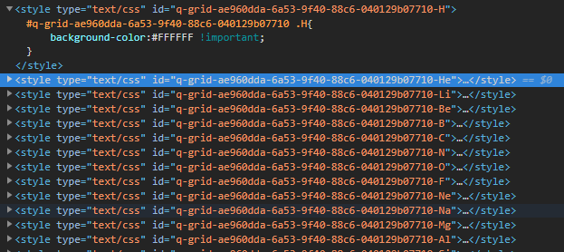

It's possible to apply custom styles to q-grid. Automatically each header and data cell has class based on column key. Easiest way to style column is adding of common css rules to your component.
Also q-grid provides way to apply styles dynamically by set up custom handlers where user has access to row and column contexts.

## Use Grid Model

Use `Grid` model to fill in `style` with cell and row appearance customization. There can be passed method which assigns class with necessary styles to cell/row. For cell you can also pass object where properties are column keys and values are the same methods. Then logic of these methods will be applied only for target column.

```typescript
import { GridComponent, StyleCellContext, StyleRowContext } from 'ng2-qgrid';

@Component({
   selector: 'my-component',
   template: '<q-grid></q-grid>'
})
export class MyComponent {
   ViewChild(GridComponent) myGrid: GridComponent;

   ngAfterViewInit() {
      const { model } = this.myGrid;
      model.style({
         cell: {
            'my-column-name': (row: any, column: Column, context: StyleCellContext) => {
               context.class(`td-${row.name}`, {
                  color: `#${row.color}`,
                  background: '#3f51b5'
               });
            }
         },
         row: (row: any, context: StyleRowContext) => {
            if (!row.isActive) {
               context.class('inactive', { opacity: '0.5' });
            }
         }
      });
   }
}
```

## Use Grid Component

Another way is binding of methods with style logic to the q-grid via attributes.

```typescript
import { StyleCellContext, StyleRowContext, Column } from 'ng2-qgrid';

@Component({
   selector: 'my-component',
   template: `
      <q-grid [styleCell]="styleCell" [styleRow]="styleRow">
         <q-grid-columns generation="deep">
         </q-grid-columns>
      </q-grid>
   `
})
export class MyComponent {
   styleCell(row: any, column: Column, context: StyleCellContext) {
      if (column.key === 'name') {
         context.class(`td-${row.name}`, {
            color: `#${row.color}`,
            background: '#3f51b5'
         });
      }
   }

   styleRow(row: any, context: StyleRowContext) {
      if (!row.isActive) {
         context.class('inactive', { opacity: '0.5' });
      }
   }
}
```



## How it works

The q-grid updates styles for cells and rows on each change detection cycle. It creates internal stylesheets and set appropriate classes to td/tr elements. Class naming allows to avoid using of inline styles and make layout recalculation faster.


